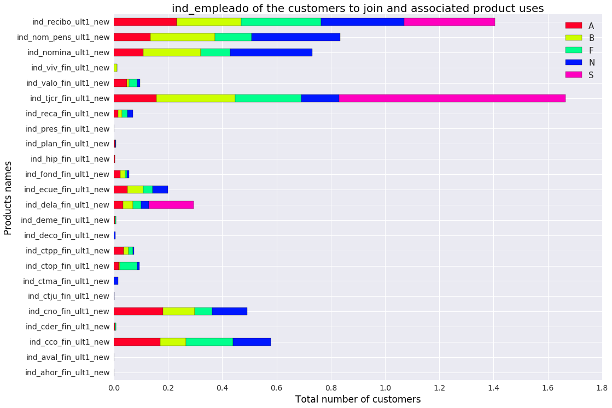

## Santander Product Recommendation Solution

#### Summary

In Santander Product Recommendation Contest the target was to recommend new products to customers based on their historical behavioral patterns, product purchase records as well as demographic information. 

#### Data

There are two datasets, train and test, with 13,647,309 and 929,615 lines respectively. The datasets contain 1.5 years of customer behaviors from Santander bank. The raw training dataset contains 48 fields among which the first 24 are customer behavioral and demographic features, and the next 24 are product purchase records, such as "credit card", "savings account", etc. The test data has only the first 24 fields and we need to make predictions on product purchases. 
After processing the data and a series of feature engineering, we have used ~ 1500 features to produce the best prediction results. 

#### Preprocessing and Cleaning
There are several practical concerns in dealing with the data. The training data was collected at the same day of each month from 2015-01-28 to 2016-05-28. The test data has customer features except product buying for 2016-06-28, and the target was to predict additional product buying for this month in addition to 2016-05-28. The evaluation metric is MAP@7. 

- **1 Incorrect/Missing Values**

The data contains both incorrect values and missing values. For example, some customer ages are less than zero, which were replaced by 0. Missing ages were imputed with the median. In addition, we restrict age range to be 18 to 100 and replace rare outliers with their corresponding boundaries. 
Another important variable is customer annual family income, for which the missing ones were replaced with medians within the same province, as we discovered the strong dependency of income with geo-location through EDA. 

- **2 Sampling bias**

The data were collected directly from customer behavior instead of sampling for certain experimental designs. Therefore it remains unknown whether these records were sampled from the entire population or not. However we analyzed the distribution of product purchase records, and there exist significant difference among different months. Data in the same month, for example, 2015-01 and 2016-01 displays more similarity than data in different months. Therefore we select months that are more similar to June for training. Some seasonal patterns were also captured during feature engineering. 

#### Methodology

The methodology is a pipeline that includes EDA, feature engineer, cross validation, variable selection and parameter tuning. I borrowed existing ideas from popular problems like CTR, and tailored the approaches particularly for this data as well. I will briefly describe major steps.

- **EDA and Feature Selection**

Basically I analyzed (1) the distribution of each feature and (2) how differently each feature was distributed, across different target labels. For example, among customers that have purchased products 1 to 24 respectively, I generated the distribution of age, family income, activity indices, etc. A feature is considered important if its distribution shows significantly different patterns among 24 groups.  
For example this image displays the EDA (2) for feature ind_empleado which turned out to be very effective in prediction power.

- **Feature Engineer**

I engineered features from low to high levels. 

- 0 Preprocessing
I binned numerical features into categorical ones based on their distributions, and merged minority levels of categorical features according to distribution similarity through EDA. This is useful especially when there are too many levels in a categorical feature, such as city/province. 

- 1 Lag Features
An important factor in the data is time dependency; therefore we added the lag features, i.e. the purchase history and activity indices of previous 11 months (as 12 is the period of one-year season.)

- 2 Status Change Features
Whether product was added, dropped, or maintained, and whether customer activity index has changed throughout past months.

- 3 Interaction
We created combined features by both tensor product and inner product among important features.

- 4 Sequence
We created sequence features, such as the combined product purchase value in selected past months, (1, 6), (2, 7) … to capture seasonality

- 5 Nearest Neighbor (NN) Features
We select nearest neighbors of each customer based on similarity and summarize their features to create NN features. 

- 6 Boosting Tree Hashing
We use the leaf indices of trained gbdt and xgboost models to encode existing features. 

- **Model**

- 1 Field-aware Factorization Machines (FFM) 
We found out the similarity between this problem and CTR prediction, considering buying a product as clicking on an ad. Therefore we adopted FFM as our first model.

- 2 LightGBM
Instead of a recommender system problem as the contest title suggested, we figured this is more of a predictive modeling problem. Therefore we chose the LightGBM model. 

- 3 Blending
We trained a softmax classifier on top of predictions from different models (FFM and LightGBM with different parameters and/or on different feature groups). 

- Variable Selection
We use feature importance output from LightGBM as a direction to trim out unimportant features, and use EDA and cross-validation to replace them with more important features. 
